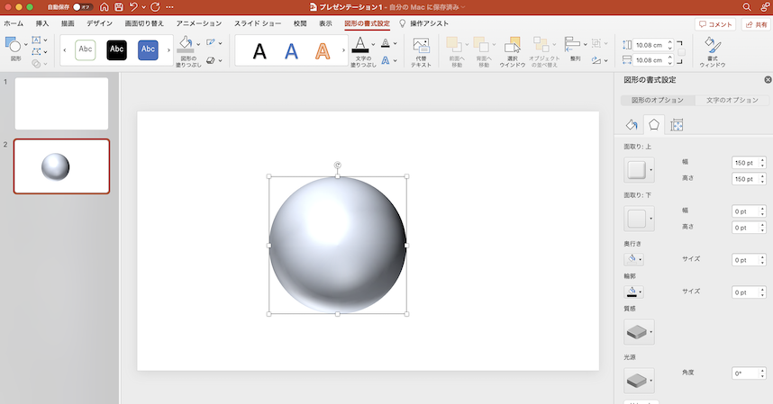
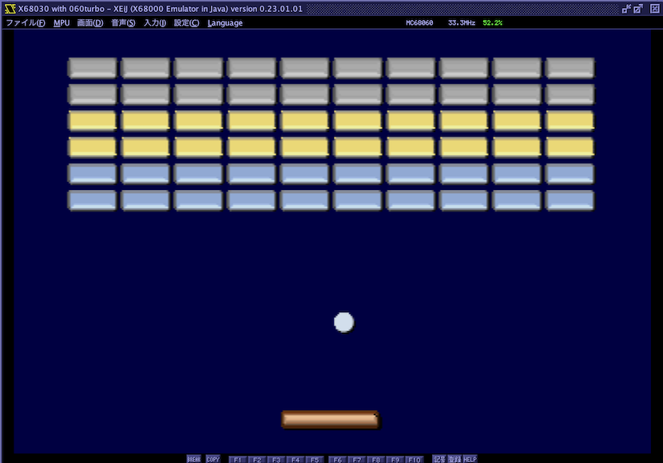

# png2sp
Transparent PNG data to X68k sprite data converter

### Install

    pip install git+https://github.com/tantanGH/png2sp.git

### Usage

    png2sp [options] <input-png-file>

Input PNG file can be RGB PNG or RGBA transparent PNG either.

    options:
        -o [output-file] ... 出力先テキストファイル名 指定しない場合は標準出力
        -f [format]      ... r: unsigned short 配列として出力  b: 1ドットごとの unsigned char 配列として出力
        -x [width]       ... 横サイズ 16の倍数であること
        -y [height]      ... 縦サイズ 16の倍数であること

---

### 出力例(raw形式, デフォルト16x16サイズ)

`$ png2sp -f r ball5.png`

    unsigned short sp_pattern_data[] = {

        /* sprite pattern data 0 */
        0x0000,0x8611,0x0006,0x1111,0x0011,0x1111,0x0111,0x1111,
        0xc411,0x1111,0x9511,0x1111,0x2451,0x1111,0x2245,0x1111,
        0x2244,0x5111,0x2224,0x4551,0xd222,0x2445,0x7222,0x2224,
        0x0a22,0x2222,0x00a2,0x2222,0x000a,0xb122,0x0000,0x7aee,
        0x1168,0x0000,0x1111,0x6000,0x1111,0x1600,0x1111,0x1160,
        0x1111,0x1118,0x1111,0x1116,0x1111,0x1111,0x1111,0x1111,
        0x1111,0x1115,0x1111,0x1114,0x5515,0x5549,0x4444,0x442c,
        0x2222,0x2290,0x2222,0x2900,0x2222,0xd000,0xbbf7,0x0000,
    };

    /* palette data */
    unsigned short sp_palette_data[] = {
        0x0000,0xe6fd,0x9ceb,0x0001,0xbdb1,0xc5f5,0xdebb,0x631b,0xce79,0x9ceb,0x6b5d,0x7ba1,0xa4eb,0x83e3,0x735f,0x7ba1,
    };

直接PCG RAMに書くことができます。

---

### 出力例 (X-BASIC like 形式, デフォルト16x16サイズ)

`$ png2sp -f b ball5.png`

    /* sprite pattern data 0 */
    unsigned char sp_pattern_data_0[] = {
        0,0,0,0,8,6,1,1,1,1,6,8,0,0,0,0,
        0,0,0,6,1,1,1,1,1,1,1,1,6,0,0,0,
        0,0,1,1,1,1,1,1,1,1,1,1,1,6,0,0,
        0,1,1,1,1,1,1,1,1,1,1,1,1,1,6,0,
        12,4,1,1,1,1,1,1,1,1,1,1,1,1,1,8,
        9,5,1,1,1,1,1,1,1,1,1,1,1,1,1,6,
        2,4,5,1,1,1,1,1,1,1,1,1,1,1,1,1,
        2,2,4,5,1,1,1,1,1,1,1,1,1,1,1,1,
        2,2,4,4,5,1,1,1,1,1,1,1,1,1,1,5,
        2,2,2,4,4,5,5,1,1,1,1,1,1,1,1,4,
        13,2,2,2,2,4,4,5,5,5,1,5,5,5,4,9,
        7,2,2,2,2,2,2,4,4,4,4,4,4,4,2,12,
        0,10,2,2,2,2,2,2,2,2,2,2,2,2,9,0,
        0,0,10,2,2,2,2,2,2,2,2,2,2,9,0,0,
        0,0,0,10,11,1,2,2,2,2,2,2,13,0,0,0,
        0,0,0,0,7,10,14,14,11,11,15,7,0,0,0,0,
    };

    /* palette data */
    unsigned short sp_palette_data[] = {
        0x0000,0xe6fd,0x9ceb,0x0001,0xbdb1,0xc5f5,0xdebb,0x631b,0xce79,0x9ceb,0x6b5d,0x7ba1,0xa4eb,0x83e3,0x735f,0x7ba1,
    };

ドットを微調整したい場合などはこちらが便利です。ただしPCG定義を行う際に変換が必要です。

---

### 出力例 (raw形式, 32x32指定 = 4つの16x16パターン)

`$ png2sp -f r -x 32 -y 32 ball5.png`

    unsigned short sp_pattern_data[] = {

        /* sprite pattern data 0 */
        0x0000,0x0000,0x0000,0x0000,0x0000,0x000e,0x0000,0x00c1,
        0x0000,0x1111,0x0000,0x1111,0x0001,0x1111,0x00d1,0x1111,
        0x0a51,0x1111,0x0b61,0x1111,0x0261,0x1111,0xd251,0x1111,
        0xb256,0x1111,0x2225,0x6111,0x2225,0x6111,0x2222,0x6111,
        0x000e,0xc111,0x0c11,0x1111,0x1111,0x1111,0x1111,0x1111,
        0x1111,0x1111,0x1111,0x1111,0x1111,0x1111,0x1111,0x1111,
        0x1111,0x1111,0x1111,0x1111,0x1111,0x1111,0x1111,0x1111,
        0x1111,0x1111,0x1111,0x1111,0x1111,0x1111,0x1111,0x1111,

        /* sprite pattern data 1 */
        0x165b,0xd000,0x1111,0x52b0,0x1111,0x1652,0x1111,0x1152,
        0x1111,0x1165,0x1111,0x1165,0x1111,0x1165,0x1111,0x1165,
        0x1111,0x1165,0x1111,0x1115,0x1111,0x1116,0x1111,0x1116,
        0x1111,0x1116,0x1111,0x1116,0x1111,0x1115,0x1111,0x1165,
        0x0000,0x0000,0x0000,0x0000,0x1000,0x0000,0x2100,0x0000,
        0x224f,0x0000,0x2294,0x0000,0x2224,0x1000,0x2224,0x4100,
        0x2227,0x4100,0x2229,0x4410,0x5222,0x4480,0x5222,0x4481,
        0x5222,0x4481,0x5222,0x4488,0x2222,0x4418,0x2229,0x4488,

        /* sprite pattern data 2 */
        0x2222,0x5111,0x2222,0x5611,0x2222,0x2561,0xb222,0x2256,
        0xd222,0x2225,0x0222,0x2222,0x0b22,0x2222,0x0022,0x2222,
        0x00d5,0x2222,0x000b,0x6222,0x0000,0x6122,0x0000,0x1115,
        0x0000,0x00c1,0x0000,0x000e,0x0000,0x0000,0x0000,0x0000,
        0x1111,0x1111,0x1111,0x1111,0x1111,0x1111,0x1111,0x1111,
        0x6611,0x1111,0x5556,0x6111,0x2255,0x5611,0x2222,0x2556,
        0x2222,0x2225,0x2222,0x2222,0x2977,0x9222,0x2297,0x4444,
        0x1622,0x2774,0x1111,0x5222,0x0e11,0x1111,0x000e,0xcc11,

        /* sprite pattern data 3 */
        0x1111,0x1165,0x1111,0x1652,0x1111,0x1552,0x1111,0x6522,
        0x1111,0x6522,0x1111,0x5222,0x1116,0x5222,0x1165,0x2227,
        0x5522,0x2274,0x2222,0x2744,0x2297,0x4444,0x4444,0x4444,
        0x4444,0x4479,0x2222,0x2222,0x1666,0x6610,0x11cc,0xe000,
        0x2227,0x4488,0x2227,0x4488,0x2294,0x4418,0x2274,0x4411,
        0x2944,0x4441,0x9444,0x4440,0x7444,0x4410,0x4444,0x4400,
        0x4444,0x4100,0x4444,0x1000,0x4444,0x0000,0x477a,0x0000,
        0x2b00,0x0000,0xd000,0x0000,0x0000,0x0000,0x0000,0x0000,
    };

    /* palette data */
    unsigned short sp_palette_data[] = {
        0x0000,0xef3d,0x9ca9,0x0001,0x631b,0xbdb1,0xc5f5,0x7ba1,0x294d,0x83e3,0x9ceb,0x9ceb,0xe6fb,0xa4eb,0xe6fb,0x5ad9,
    };

---

### 定義例

スーパーバイザモードで実行のこと

    #define SP_PALETTE_REG  ((volatile unsigned short*)0xE82200)
    #define PCG_DATA_REG    ((volatile unsigned short*)0xEB8000) 

    // set sprite palette
    void setup_sp_palette(int palette_block, unsigned short* palette_data) {
        for (int i = 0; i < 16; i++) {
            SP_PALETTE_REG[ palette_block * 16 + i ] = palette_data[i];     // direct access
            //SPALET(0x80000000 | i, palette_block, palette_data[i]);       // = IOCS call
        }
    }

    // set sprite patterns
    void setup_sp_patterns(int pattern_number, unsigned short* pattern_data, int pattern_count) {
        for (int i = 0; i < pattern_count; i++) {
            for (int j = 0; j < 0x40; j++) {                                                        // direct access 
                PCG_DATA_REG[ ( pattern_number + i )  * 0x40 + j ] = pattern_data[ i * 0x40 + j ];   
            }
            //SP_DEFCG(pattern_number + i, 1, (unsigned char*)(pattern_data + i * 0x40));           // = IOCS call
        }
    }

    // set basic sprite pattern
    void setup_sp_pattern_basic(int pattern_number, unsigned char* pattern_array) {
        unsigned char pattern_data[ 0x80 ];
        for (int y = 0; y < 8; y++) {
            for (int x = 0; x < 4; x++) {
                pattern_data[ 0x00 + y*4 + x ] = ( pattern_array[ (y+0)*16 + (x+0)*2 ] << 4 ) | ( pattern_array[ (y+0)*16 + (x+0)*2 + 1]);
                pattern_data[ 0x20 + y*4 + x ] = ( pattern_array[ (y+8)*16 + (x+0)*2 ] << 4 ) | ( pattern_array[ (y+8)*16 + (x+0)*2 + 1]);
                pattern_data[ 0x40 + y*4 + x ] = ( pattern_array[ (y+0)*16 + (x+4)*2 ] << 4 ) | ( pattern_array[ (y+0)*16 + (x+4)*2 + 1]);
                pattern_data[ 0x60 + y*4 + x ] = ( pattern_array[ (y+8)*16 + (x+4)*2 ] << 4 ) | ( pattern_array[ (y+8)*16 + (x+4)*2 + 1]);
            }
        }
        setup_sp_pattern(pattern_number, (unsigned short*)pattern_data, 1);
    }

---

### 変換実行サンプル (PowerPointで透過PNGを生成後、変換)

パワポで「図形として保存」を選択すると透過PNG形式で保存できます。

---

### Windowsユーザ向けPython導入ガイド

[詳細な日本語での導入ガイド](https://github.com/tantanGH/distribution/blob/main/windows_python_for_x68k.md)
